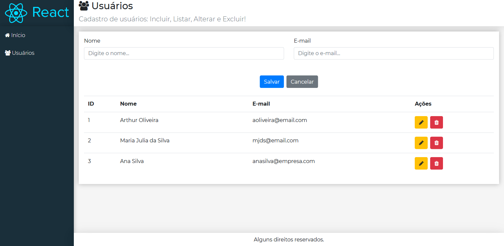

# React CRUD

## Descrição

Pequeno projeto feito durante os meus estudos de React. Neste site é possível realizar um CRUD de usuários.

## Tecnologia Utilizada

O front-end foi implementado usando o framework [React](https://pt-br.reactjs.org/).

## Extensões e Bibliotecas Utilizadas

Para simular um back-end foi utilizado o [typicode/json-server](https://github.com/typicode/json-server).

